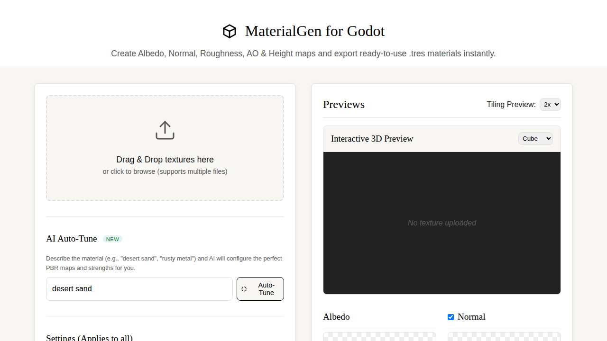

# MaterialGen for Godot 4 📦

A powerful, entirely client-side web application designed to instantly generate ready-to-use `.tres` PBR materials and textures for Godot 4 Engine directly from your browser. Perfect for indie developers, technical artists, and 3D generalists.

**🌍 [Русская версия ниже](#russian-version)**

## ✨ Features

- **Instant Map Generation**: Upload an Albedo (Base Color) texture, and MaterialGen automatically generates corresponding **Normal, Roughness, Ambient Occlusion, Height, and Metallic maps** directly in your browser.
- **AI Auto-Tune**: Describe your material (e.g., "desert sand" or "rusty metal"), and the integrated **Groq AI (Llama 3.3 70B)** will automatically configure the optimal map strengths and toggles for realistic rendering. Simply enter your Groq API key in the UI.
- **Seamless Tiling**: Check a single box to make any uploaded texture seamlessly tileable. Features multiple algorithms including crossfade, offset-and-blend, and mirrored processing.
- **Interactive 3D Preview**: Visualize your material in real-time on various 3D primitives (Cube, Sphere, Plane, Cylinder) with customizable environment lighting, built natively with Three.js.
- **Batch Export**: Download all generated maps and Godot `.tres` material files in a single `.zip` archive. Paths inside the `.tres` files are automatically formatted using relative Godot structures (`ext_resource`) so they work instantly upon import to your project folder.
- **100% Client-Side**: No backend required. Your images are processed securely and locally within your browser using the HTML5 Canvas API.

## 🚀 Getting Started

1. Visit the hosted GitHub Pages URL.
2. Drag and drop your source textures.
3. Use the AI Auto-Tune or manually adjust sliders to perfect your material.
4. Click "Download All as ZIP" and extract the contents directly into your Godot project.

---

# MaterialGen для Godot 4 📦

Мощное, полностью клиентское веб-приложение, предназначенное для мгновенного создания готовых к использованию PBR-материалов (файлы `.tres`) и текстур для игрового движка Godot 4 прямо в браузере.

## ✨ Особенности

- **Мгновенная генерация карт**: Загрузите текстуру Albedo (базовый цвет), и MaterialGen автоматически сгенерирует соответствующие карты **Normal, Roughness, Ambient Occlusion, Height и Metallic**.
- **Умная настройка через ИИ (Auto-Tune)**: Просто опишите ваш материал (например, "пустынный песок" или "ржавый металл"), и встроенный **ИИ Groq (модель Llama 3.3 70B)** автоматически подберет идеальные настройки силы карт для реалистичного рендера. Просто введите ваш ключ Groq API в интерфейсе.
- **Бесшовные текстуры**: Сделайте любую загруженную текстуру бесшовной (тайловой) в один клик. Поддерживает несколько алгоритмов: offset-and-blend, crossfade и отзеркаливание.
- **Интерактивный 3D-предпросмотр**: Просматривайте ваш материал в реальном времени на различных 3D-примитивах (Куб, Сфера, Плоскость, Цилиндр) с настраиваемым освещением.
- **Пакетный экспорт**: Скачивайте все сгенерированные карты и файлы материалов `.tres` для Godot в одном `.zip` архиве. Пути внутри файлов `.tres` автоматически форматируются под структуру Godot (`ext_resource`), поэтому они работают сразу после импорта в папку проекта.
- **100% клиентская обработка**: Не требует бэкенда или серверов. Ваши изображения обрабатываются безопасно и локально в вашем браузере с помощью HTML5 Canvas API.

## 🚀 Как начать

1. Откройте сайт (GitHub Pages).
2. Перетащите исходные текстуры.
3. Используйте ИИ (Auto-Tune) или вручную настройте ползунки.
4. Нажмите "Скачать все в ZIP" и распакуйте архив прямо в проект Godot.